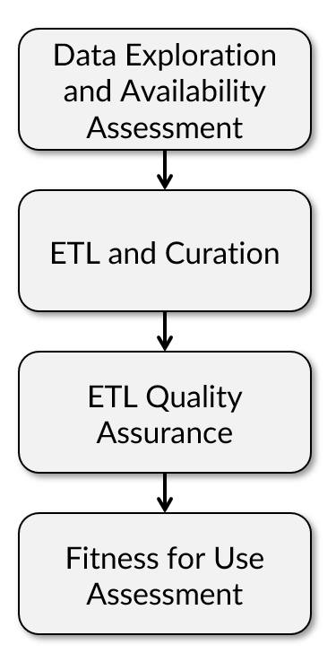
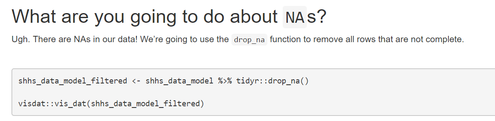

layout: true
background-image: url(image/ohsu.png), url(image/logo.png)
background-position: 95% 5%, 95% 95%
background-size: 7%, 20%

```{r setup, include=FALSE}
options(htmltools.dir.version = FALSE)
library(gt)
```
---
# Disclosure

No disclosures to report.

---
# Learning Objectives for this Session

- **Learn** about the challenges of developing multidisciplinary workshops
- **Understand** why exploratory data analysis is an important data science skill
- **Discuss** why iterative learning is helpful in understanding clinical data

---
# Introduction: Ted Laderas

.pull-left[ 
- Assistant Professor, Oregon Health & Science University
  - Department of Medical Informatics and Clinical Epidemiology
  - Division of Bioinformatics and Computational Biomedicine 
- Research Interests
  - **Education (active learning)**
  - **Interactive Visualization**
  - **Open Science**
  - Immunoinformatics
  - Drug Sensitivity/Resistance in Cancer
  ]

.pull-right[

]
---
# Overview

- Why clinical data wrangling?
- Why the workshop?
- What is the workshop?
- Components of the workshop
- Extensions
- Availability

---
# Motivation: Why?


---

# Applies to Informaticians, Too


- Emphasize successful informatics being collaboration
- Research is multi-disciplinary
- Need for Translational Research Workforce
- Bridge gaps between computational biology and clinical realms

---
# Luckily, there was funding

- NLM T15 Training Grant Supplement for Data Science
- Allowed a diverse team to come together:
    - Eilis Boudreau, MD/PhD (Sleep Neurologist)
    - Nicole Weiskopf, PhD (EHR Data Quality)
    - Ted Laderas, PhD (Education, Interactive Visualization)

---
# Clinical Data Wrangling

.pull-left[
- Workshop for incoming graduate students
- Audience: Clinical/Bioinformatics Students
  - Assumes no expertise with R/RStudio
- Introduce students to data quality issues with clinical data
- Context: Secondary use of a clinical dataset
  - Can we use it for prediction of cardiovascular disease?
  - What variables can we use?
]

.pull-right[

]

---

# Learning Objectives

.pull-left[
1. **Understand** the biology of sleep and sleep apnea and how the biology informs the covariates measured in the Sleep Heart Health Study
1. **Understand** the usefulness and challenges with working with clinical data
1. **Learn** Exploratory Data Analysis techniques and use them to **inform/analyse** model building
1. **Build** and **Evaluate** a predictive model (logistic regression) using simple diagnostics.
1. **Communicate** your findings in a team setting.
]
.pull-right[

]
---

# Challenges: Where to get data?

- Partnership with National Sleep Research Resource 
    - http://sleepdata.org
- Sleep Heart Health Study data 
    - ~5700 patients, 1200 covariates
- Requires students to sign [data use agreement]()

---
## Sleep Covariates

```{r echo=FALSE}
dict <- read.csv("data_description.csv")
gt(dict[1:10,-1])
```
---
# Workshop is split over multiple days

.pull-left[
- **Day 1** (8 Hrs):
  - Logistics
  - Intro to sleep data
  - Intro to data reuse and data quality
  - Data exploration of sleep data
  - Intro to logistic regression
  ]
.pull-right[
- **Day 2** (2 hrs): 
  - Logistic regression Q&A
  - Assignment: Is Race appropriate?
- **Day 3** (2 hrs):
  - Is hypertension appropriate?
  - Final presentation prep
- **Day 4** (1.5 hrs):
  - Final Presentation by groups
]

---
# Social Learning

- Code of Conduct
- Introduce students to each other
- Psychological Safety
- Diverse/Heterogeneous teams 

.footnote[[What Every Data Scientist Should Know about Education](https://resources.rstudio.com/webinars/what-every-data-scientist-should-know-about-education-greg-wilson)]

---

# Lecture: Background about Sleep

- Eilis Boudreau: Sleep Neurologist
- Role of sleep disorders in cardiovascular disease 
- How we measure sleep disorders


.footnote[[Image from Wikipedia](https://en.wikipedia.org/wiki/Sleep_apnea#/media/File:Obstruction_ventilation_apn%C3%A9e_sommeil.svg)]

---

# Lecture: Data Reuse and Data Quality Issues

- Nicole Weiskopf
- Expose students early on to data quality issues
- Hazards and bonuses of data reuse
- Biases of Clinical Data


---

# Making Decisions by Exploring Data

.pull-left[
- Shiny app (burro) that lets students explore dataset interactively
- Code-less, assumes no coding expertise
- Can be deployed as a website
]
.pull-right[

]

---
# burro: Visual Summary of the Data


.footnote[[visdat package by Nick Tierney](http://visdat.njtierney.com/)]
---

# burro: Single Categories to CrossTabs


---

# burro: Histograms to Boxplots


---

# Building Predictive Models by Making Decisions

- Rstudio notebook that [guides students through modeling process](https://laderast.github.io/clinical_data_wrangling/notebooks/predictive_model.nb.html)
  - Choice of covariates
  - Simple data cleaning/impact on dataset
  


---

# Modeling the Data

.pull-left[
- Assessing Impact of logistic regression
- Understanding and evaluating model predictions
- Splitting Data: Test/Train Datasets
- Diagnostic Testing and their uses
  -Patients who are on the edge
    ]
    
.pull-right[ 
1. **patient 1** is older 65, Male, and has a higher BMI (44). 
1. **patient2** is younger 25, Female and has a lower BMI (23). 
1. **patient3** is a middle aged (42), Female patient with a middling BMI (31).
]

---

# Day 2/3: Iterating your model: what about Race/Hypertension?

- Understanding the contributions of `race`
  - How is it defined? 
  - How does our study population compare to the US?
- Understanding `hypertension` as a variable
  - Medication Lists
  - Blood pressure measurements
---

# Day 4: Final Analysis: Making and Documenting Critical Decisions

.pull-left[- Final presentation is an R Notebook
- What variables did you use at each step?
- Why did you include them?
- What were your values?
- How did that affect your results?]

.pull-right[]

---

# Challenges: There is no right answer

- Data Use Agreements required for student participation
- Students wanted to choose an "optimal" threshold for models
- Challenges in understanding importance of how a clinical test would be used

---

# Outcomes

- Sets the tone for our program
- Good opportunity for clinical/bioinformatics students to meet
- Currently assessing impact on students after 1 year in program

---

# Extensions: Data Science for MD/PhDs

- Reframe as clinical case (Kristen Stevens)


---

# Extensions: Data Scavenger Hunts

.pull-left[ 
- [Exploring the NHANES dataset](http://bit.ly/csv_burro)
- [OHSU BioData Club activity](http://biodata-club.github.io)
]
.pull-right[]
---

# Acknowledgements:

- Bill Hersh
- Diane Doctor
- T15 NLM Training Supplement Grant: 5T15LM007088
- Susan Redline/Dan Mobley at NSRR
- Incoming class of 2018 informatics students
- MD/PhD Students
- BioData Club Members

---

# Are you interested? 

Keep in touch! We want others to utilize the workshop!

laderast@ohsu.edu | @tladeras | http://laderast.github.io  

- These slides: http://bit.ly/ted-ief2019
- Burro: http://laderast.github.io/burro
- Workshop: http://laderast.github.io/clinical_data_wrangling/
