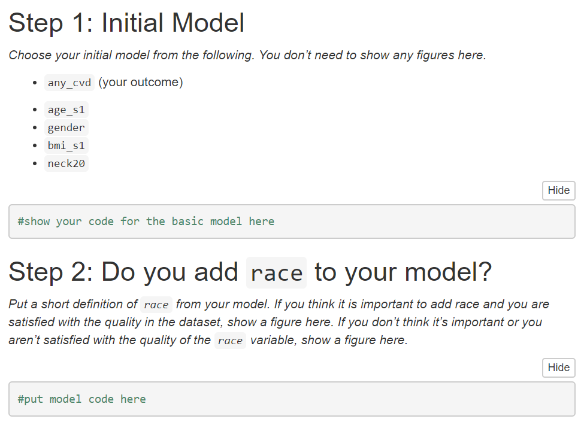
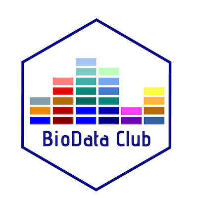

```{r setup, include=FALSE}
options(htmltools.dir.version = FALSE)
```
# Introduction: Ted Laderas

- Assistant Professor
  - Division of Bioinformatics and Computational Biomedicine 
  - Department of Medical Informatics and Clinical Epidemiology
  - Oregon Health & Science University
- Research Interests
  - Education (active learning)
  - Interactive Visualization
  - Immunoinformatics
  - Drug Sensitivity/Resistance in Cancer

---
# Overview

- Why teach bioinformatics students about clinical data?
  - Encourage translational research
- How do we teach them?
  - Clinical Data Wrangling
  - Data Analytics
  - BioData Club
- Who are examples of our success?
  - Gabby Choonoo
  - Connor Smith

---
# Motivation: Why?

- Research is multi-disciplinary
- Need for Translational Research Workforce
- Bridge gaps between computational biology and clinical realms

---
# Bioinformatics Students: Clinical Data Opportunities

- Clinical Data Wrangling Workshop
- BMI569 Data Analytics
- BioData Club

---
# Clinical Data Wrangling

- Designed for both clinical and bioinformatics students
- Introduce students to data quality issues with clinical data
- Use Sleep Heart Health Study data
  - Partnership with http://sleepdata.org
- http://laderast.github.io/clinical_data_wrangling/

.footnote[Eilis Boudreau, Ted Laderas, Nicole Weiskopf]
---
# The Goal: build a predictive model of Cardiovascular Disease

.pull-left[
- Biology of Sleep
- Data Quality Issues 
- Exploring the Dataset 
- Building a predictive model
- Reporting your predictive model
]

.pull-right[]

---
# Making Decisions by Exploring Data

- Shiny app (burro) that lets students explore dataset
- Code-less, assumes no coding expertise


---
# Building Predictive Models by Making Decisions


---
# Outcomes

- Currently assessing impact on students

---
# BMI569: Data Analytics

- Summer Hybrid Course taught jointly with Kaiser Permanente
- Focus on helping make decisions in a Health Care Setting
- Sociotechnical challenges in implementing a predictive model
  - Implementing a predictive model (R-based)
  - Organizational Lectures and Challenges from Kaiser
  
.footnote[David Dorr, Tracy Edinger, *Ted Laderas*, Shannon McWeeney, *Delilah Moore*, and *Brian Sikora*]

---
# BMI569: Practical Coursework

- 8 weeks online coursework in R/SQL and 1 week in person
- Patients assess and query a simulated data warehouse
- Rmarkdown document based assignments
  - provide guidance 
- http://laderast.github.io/AnalyticsCourse

---
# Mixing Clinical and Bioinformatics

- Roughly 50% Clinical/50% Bioinformatics
- Opportunity! Pair them up for joint learning
- Learn skills and challenges from each other

---
# Goals

.pull-left[
- Predict 30-day hospital readmissions
- Joining/Querying/Data
- Implementing the LACE metric and assessing it
- Kaiser Experience in Implementation and Impact
- Communicating your results to an executive team]

.pull-right[
]

.footnote[https://greatplainsqin.org/wp-content/uploads/2015/01/Lace-Index-Scoring-Tool.pdf]

---
# Analytics Course: Successes

- Nominated for a course award by our students
- Students have gone on to work for Kaiser

---
# BioData Club

.pull-left[
- Lifelong Learning Group about Data Science
- Cross Disciplinary / Hierarchy Flattening
- Psychologically safe space to learn 
- Teaching Opportunity
- Lots of workshops/social activities!
]

-.pull-right[

]

.footnote[http://biodataclub.github.io]

---
# BioData Club Kit 

- Start a BioData Club at your Institution!
- Part of CD2H (Center for Data to Health)
- Contact me if interested!


---
# Student Successes

- Gabrielle Choonoo
- Connor Smith

---
# Gabrielle Choonoo

"Genomic Stability of Solid Tumors and Clinical Applications"


---
# Connor Smith

- OSU Graduate in Biology
- Thesis: Methylation Effects in AML
- Now working in a clincal setting!


---
# Principles and Values

- Reduce barriers between clinical and computational cultures
- Pair clinical/bioinformatics students for co-learning
- Flatten hierarchies for co-learning
- Value lifelong learning as an attitude

---
# Funding Acknowledgements:

- T15 NLM Training Supplement Grant: 5T15LM007088
- NCATS Center for Data to Health (CD2H) Grant: U24TR002306

---
# Keep in Touch!

laderast@ohsu.edu | @tladeras | http://laderast.github.io  

- http://laderast.github.io/AnalyticsCourse
- http://laderast.github.io/burro
- http://laderast.github.io/clinical_data_wrangling/
- BioData-Club Kit: http://biodataclubkit.github.io

Learn more about our graduate program!  

- 4/23, 10 AM - 2 PM @ OSU PreHealth Fair (Memorial Union Ballroom)
- Webinars about 
  - Clinical and Bioinformatics Majors 
  - email Lauren Ludwig: ludwigl@ohsu.edu
  
